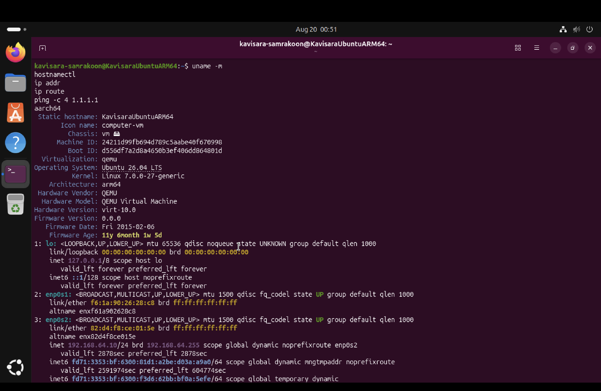
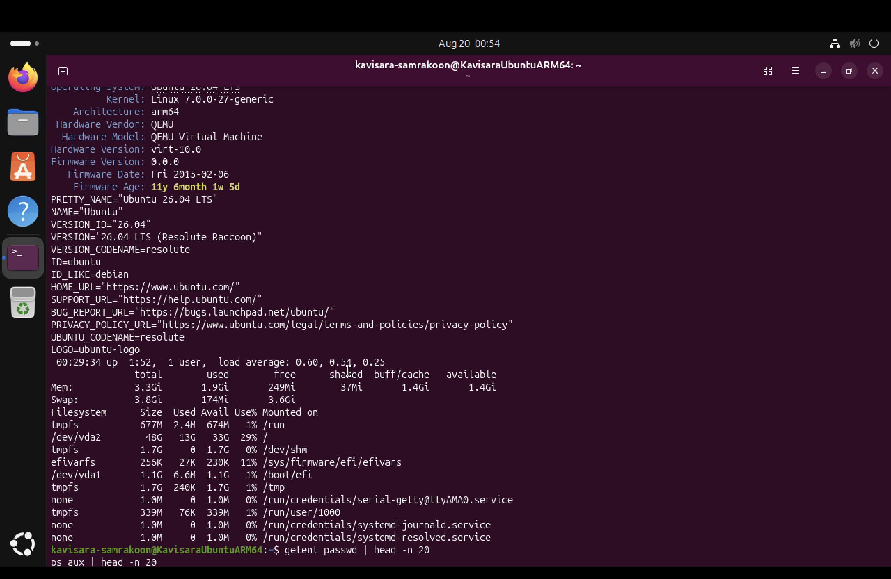
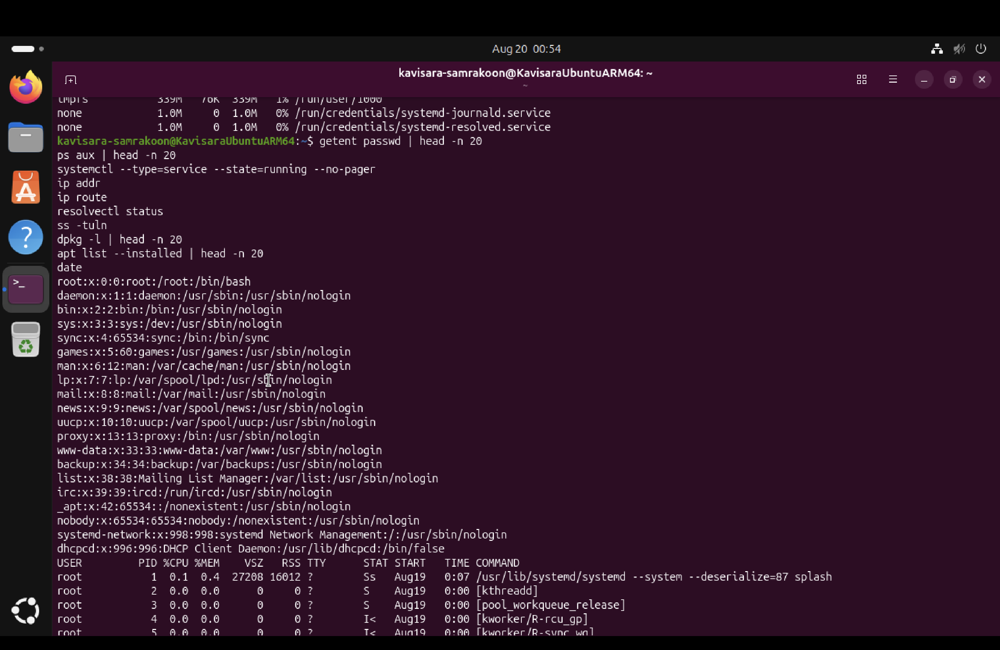
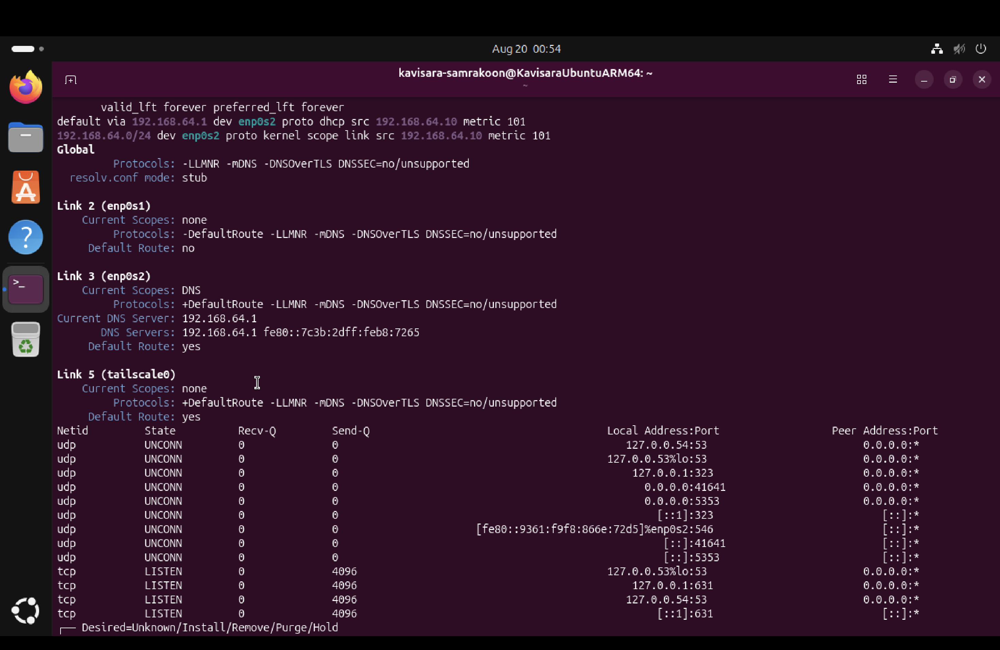
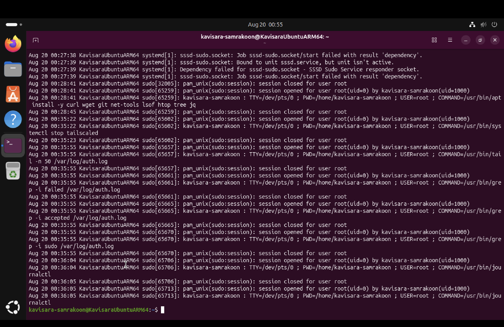

# ARM-SecNet V1 Screenshot Evidence

This document records screenshot evidence from the first ARM-SecNet V1 test on a real Ubuntu ARM64 VM running in UTM.

## Test Environment

| Item | Details |
|---|---|
| Host | Apple Silicon Mac |
| Virtualization | UTM / QEMU |
| Guest VM | Ubuntu 26.04 LTS |
| Architecture | ARM64 / aarch64 |
| Network Mode | UTM Shared/NAT |
| Main VM IP | 192.168.64.10 |
| Gateway/DNS | 192.168.64.1 |

## Screenshot Evidence

### 1. ARM64 Architecture Confirmation



This screenshot confirms that the VM is running ARM64/aarch64 Linux under QEMU virtualization.

### 2. UTM Shared/NAT Network Baseline



This screenshot shows the VM network interface, UTM Shared/NAT IP address, route, DNS configuration, and listening ports.

### 3. Lab 01 System Baseline Output



This screenshot shows baseline investigation output including operating system, kernel, memory, disk usage, and system information.

### 4. Lab 01 Users and Processes



This screenshot shows local user review and process review output used during Lab 01 testing.

### 5. Lab 02 Authentication Log and Sudo Activity



This screenshot shows authentication log review and sudo command activity used during Lab 02 testing.

## Result

The first ARM-SecNet V1 test produced valid screenshot evidence for:

- ARM64 architecture confirmation
- UTM/QEMU virtualization
- Shared/NAT networking
- Linux baseline investigation
- authentication log analysis
- sudo activity review

Overall result:

```text
ARM-SecNet V1 documentation MVP passed first real VM test with evidence.
```
