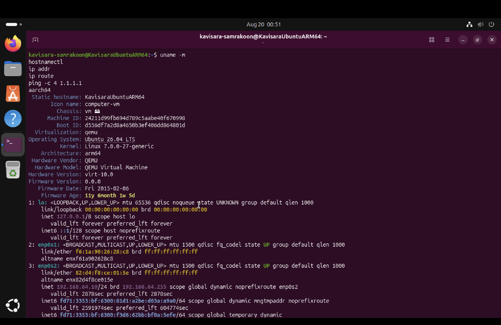
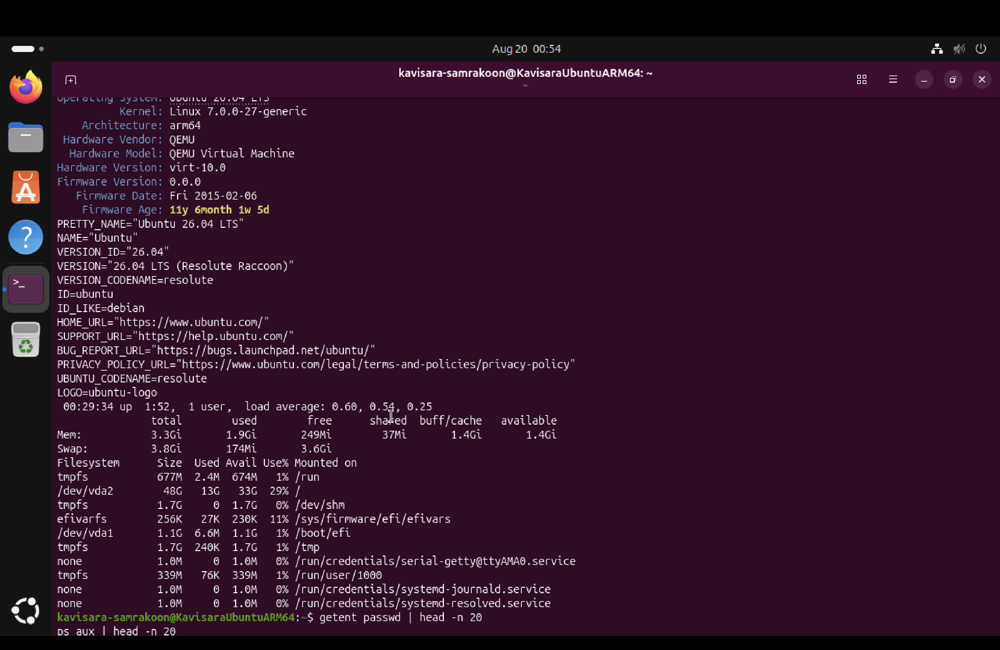
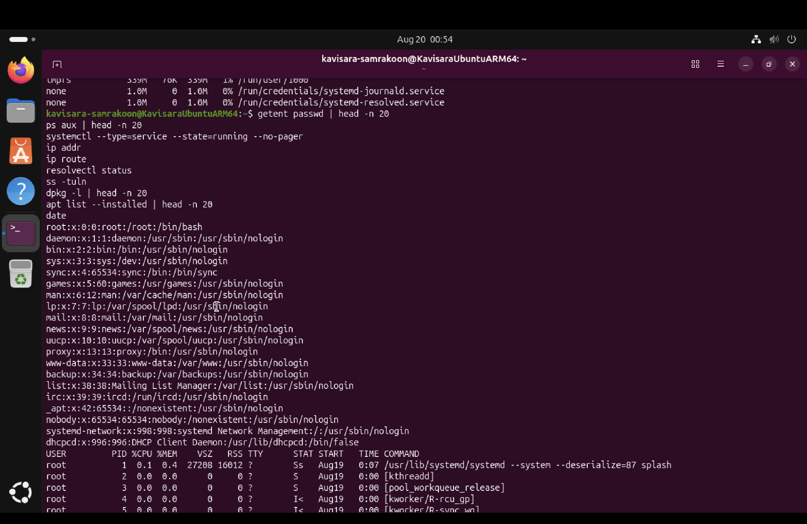
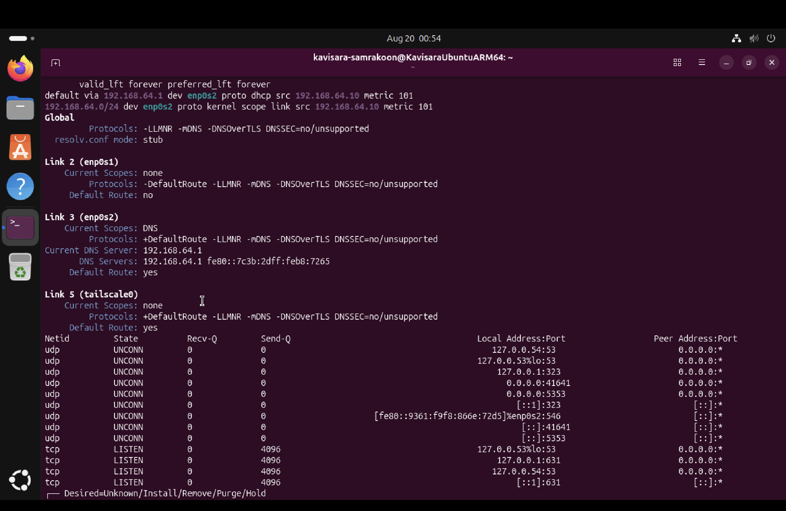
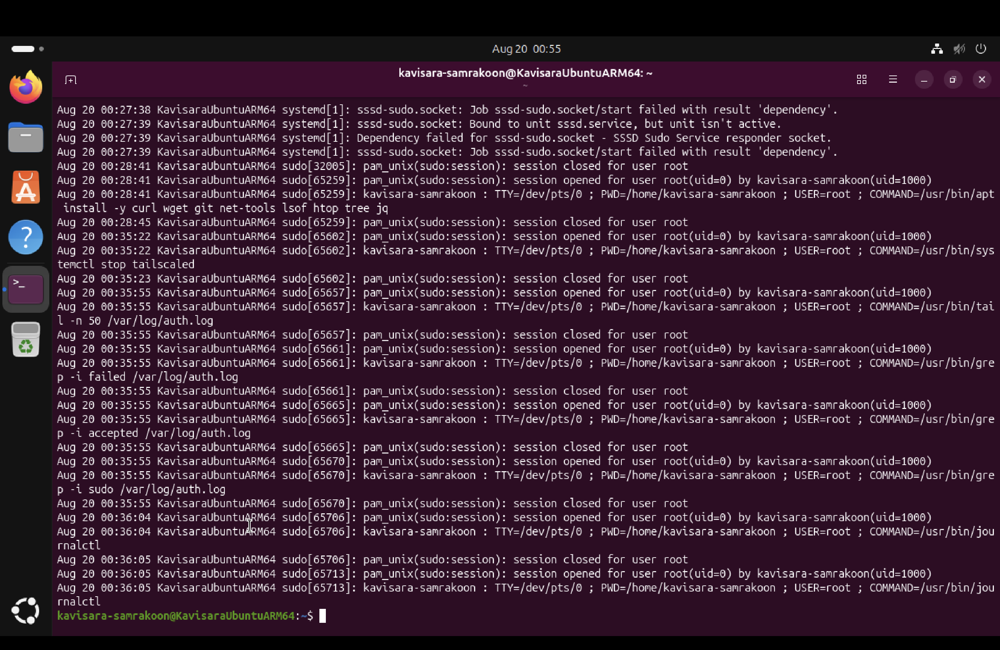

# ARM-SecNet V1 Screenshot Evidence

This document records screenshot evidence from the first ARM-SecNet V1 test on a real Ubuntu ARM64 VM running in UTM.

The screenshot files below are historical evidence from the original V1 validation run. Their filenames are preserved unchanged for provenance and release-history integrity. During the V1.2 documentation audit, screenshots 02, 03, and 04 were found to contain different evidence categories from those implied by their historical filenames. The descriptions below therefore document the actual visible contents of each preserved file.

## Test Environment

| Item | Details |
|---|---|
| Host | Apple Silicon Mac |
| Virtualization | UTM / QEMU |
| Guest VM | Ubuntu 26.04 LTS |
| Architecture | ARM64 / aarch64 |
| Network Mode | UTM Shared/NAT |
| Main VM IP | 192.168.64.10 |
| Gateway/DNS | 192.168.64.1 |

## Screenshot Evidence

### 1. ARM64 Architecture Confirmation



This screenshot confirms that the VM is running ARM64/aarch64 Linux under QEMU virtualization.

### 2. Historical File 02 — System Baseline and Resource Information



Despite the historical filename `02-network-shared-nat.png`, this screenshot shows system baseline information including Ubuntu release details, uptime, memory usage, disk usage, and the beginning of local user enumeration.

The filename is preserved unchanged because this is historical V1 evidence.

### 3. Historical File 03 — Local Users and Running Processes



Despite the historical filename `03-lab01-system-baseline.png`, this screenshot shows local user records and running-process output used during Lab 01 investigation.

The filename is preserved unchanged because this is historical V1 evidence.

### 4. Historical File 04 — Network, DNS, Interfaces, and Listening Sockets



Despite the historical filename `04-lab01-users-processes.png`, this screenshot shows routing information, DNS/resolver status, network interfaces, and listening sockets used during the V1 network baseline review.

The screenshot also contains a `tailscale0` interface from that historical VM. Its presence proves only that the interface existed in the VM at capture time; it does not establish that ARM-SecNet lab traffic used Tailscale.

The filename is preserved unchanged because this is historical V1 evidence.

### 5. Lab 02 Authentication Log and Sudo Activity



This screenshot shows authentication log review and sudo command activity used during Lab 02 testing.

## Evidence Provenance and Limitations

These files document one historical ARM-SecNet V1 validation environment.

The [historical screenshot SHA-256 manifest](historical-screenshot-sha256.txt) records all 13 preserved V1 and V1.1 PNGs. From the repository root, verify them with `shasum -a 256 -c docs/evidence/historical-screenshot-sha256.txt`.

They do not establish:

- universal ARM64 compatibility;
- compatibility with every Ubuntu, Debian, UTM, or Linux configuration;
- use of a standardized clean classroom VM;
- exact SentinelLite `v1.2.0-beta` release-wheel validation;
- absence or use of unrelated software or network interfaces present in the historical VM.

Future V1.2 validation evidence should be recorded separately rather than replacing these historical screenshots.

## Result

The first ARM-SecNet V1 test produced screenshot evidence for:

- ARM64 architecture confirmation;
- UTM/QEMU virtualization;
- Linux system and resource baseline investigation;
- local user and process investigation;
- network, DNS, interface, and listening-socket review;
- authentication log analysis;
- sudo activity review.

Overall result:

```text
ARM-SecNet V1 documentation MVP passed first real VM test with evidence.
```
